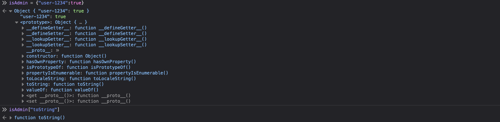

# funnylogin


## Solution

Truy cập URL được cung cấp, chúng ta sẽ thấy trang web như sau:


Mở source code được cung cấp và đọc file `app.js`, chúng ta hiểu rằng cần phải làm cho khối code bên dưới được thực thi để lấy flag.


Chúng ta có thể thấy rằng, cả hai giá trị của biến `user` và `pass` lấy từ request được đưa vào câu truy vấn mà không qua bất kì bước xử lý nào. Do đó, chúng ta có thể thực hiện khai thác SQL injection.


Giá trị `id` chính là index của array `users`. Array này gồm 100000 phần tử, mỗi phần tử là một object với hai property là `user` và `pass` đều có giá trị ngẫu nhiên.

```javascript
const users = [...Array(100_000)].map(() => ({ user: `user-${crypto.randomUUID()}`, pass: crypto.randomBytes(8).toString("hex") }));
db.exec(`INSERT INTO users (id, username, password) VALUES ${users.map((u, i) => `(${i}, '${u.user}', '${u.pass}')`).join(", ")}`);
```

`isAdmin` cũng là một object, nó có một property (tên của user ngẫu nhiên) với giá trị `true`.


Để khối code trong câu lệnh `if` thứ hai có thể được thực thi, chúng ta cần phải bypass câu lệnh `if` thứ nhất và khiến `users[id]` trả về một object. Vậy chúng ta nhập `pass` là `' UNION SELECT 1--` để `id` sẽ nhận giá trị `1` từ kết quả của câu truy vấn.

Tiếp theo, thay vì phải tìm đúng tên `user` để khiến cho `isAdmin[user]` trả về `true` thì chúng ta có thể tận dụng property `toString` trong prototype của object `isAdmin` để khiến nó trả về function:



Từ đó mà điều kiện `users[id] && isAdmin[user]` sẽ được đánh giá là `true`, khối code trong câu lệnh `if` thứ hai sẽ được thực thi và chúng ta lấy được flag:


## Flag

`dice{i_l0ve_java5cript!}`
