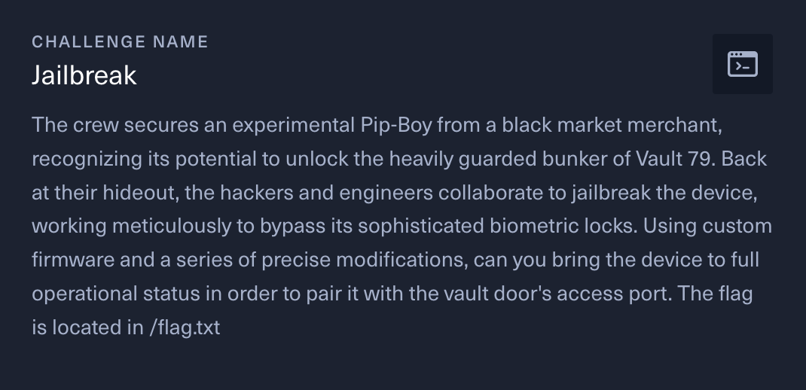
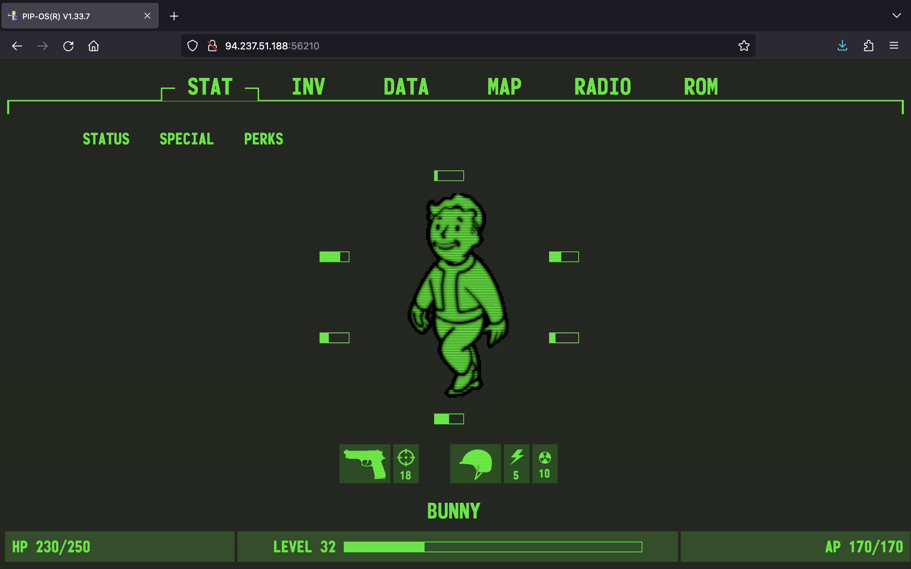
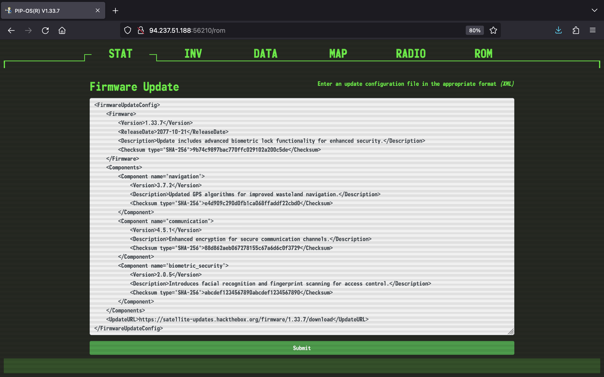
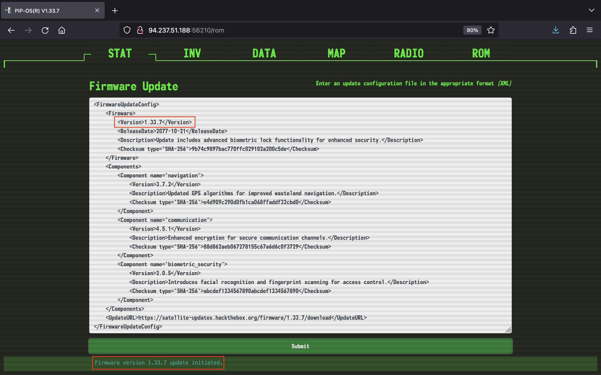
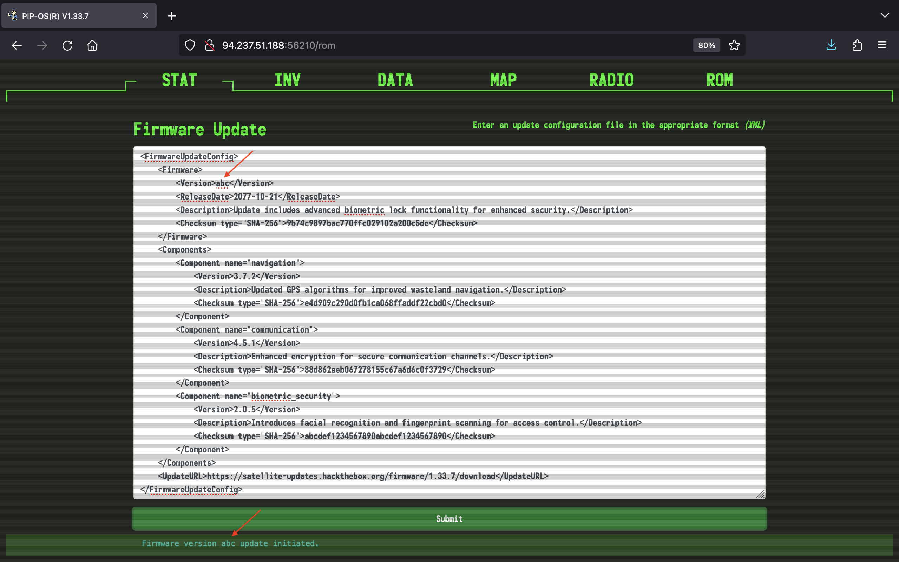
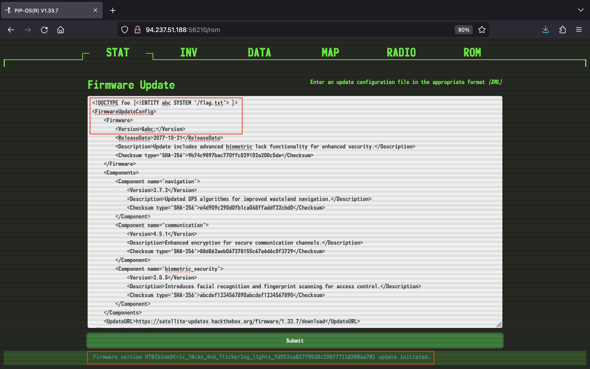

# Jailbreak



## Solution

Truy cập vào vào URL của challenge, mình thấy một trang web như sau:



Lần lượt xem qua từng tab trong menu, mình chú ý tới tab ROM, mình nghĩ có thể khai thác lỗ hổng XXE tại đây:



Ứng dụng cho phép mình nhập vào dữ liệu với định dạng XML để cập nhật firmware.
Trước tiên, mình thử nhấn nút Submit thì thấy giá trị của `Version` được trả về trong response:



Mình thử thay giá trị của nó thành `abc` và cũng nhận về response chứa `abc`:



Như vậy, mình có thể thử tham chiếu tới external entity trong phần tử `Version`. Bởi vì mô tả của challenge có nói flag nằm ở `/flag.txt` nên mình định nghĩa một external entity `&abc;` với giá trị là nội dung của file `/flag.txt` bằng cách sử dụng payload sau:

```xml
<!DOCTYPE foo [<!ENTITY abc SYSTEM "/flag.txt"> ]>
```

Submit và mình đã thành công lấy được flag:



## Flag

`HTB{b1om3tric_l0cks_4nd_fl1cker1ng_l1ghts_fd953ca827f9938c299f77118208aa70}`
