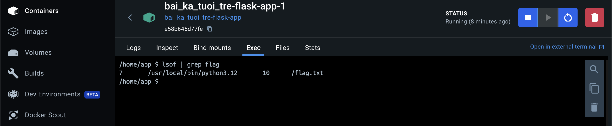

# Bài Ka Tuổi Trẻ


## Solution

Thử thách này mình đọc nội dung của file `/flag.txt` bằng cách tận dụng file descriptor <https://book.hacktricks.xyz/pentesting-web/file-inclusion#via-proc-fd>.

Truy cập vào URL của challenge, mình thấy trang web như sau:


Mình để ý lên tham số `file` ở URL liền nghĩ ngay tới khai thác lỗ hổng Path Traversal. Mình thử thay giá trị của tham số này thành `/etc/passwd` xem sao:


Đọc thành công file `/etc/passwd`.

Mở source code, để ý trong Dockerfile mình nhận thấy file `flag.txt` nằm ở `/`.


Đọc file `app.py`:

```python
@app.get('/')
def home():
    if request.args.get('file'):
        filename = join("./static", request.args.get('file'))
        if isfile(normpath(filename)) and access(normpath(filename), R_OK) and (stat(normpath(filename)).st_size < 1024 * 1024 * 2):
            try:
                with open(normpath(filename), "rb") as file:
                    if not regex.search(r'^(([ -~])+.)+([(^~\'!*<>:;,?"*|%)]+)|([^\x00-\x7F]+)(([ -~])+.)+$', filename, timeout=2) and "flag" not in filename:
                        return file.read(1024 * 1024 * 2)
            except:
                pass
    return redirect("/?file=index.html")
```

Đoạn code trên sẽ thực hiện kiểm tra xem có tham số `file` trong URL hay không. Nếu có, giá trị của nó sẽ được nối vào đường dẫn `./static` và lưu vào biến `filename`. Tiếp đến, nó sẽ kiểm tra xem file có tồn tại hay không, người dùng có quyền truy cập tới file không và kích thước của file có nhỏ hơn 2 MB không:

```python
if isfile(normpath(filename)) and access(normpath(filename), R_OK) and (stat(normpath(filename)).st_size < 1024 * 1024 * 2):
```

Mình đặc biệt chú ý đến đoạn code bên dưới:

```python
with open(normpath(filename), "rb") as file:
    if not regex.search(r'^(([ -~])+.)+([(^~\'!*<>:;,?"*|%)]+)|([^\x00-\x7F]+)(([ -~])+.)+$', filename, timeout=2) and "flag" not in filename:
        return file.read(1024 * 1024 * 2)
```

Có thể thấy rằng, file chúng ta truyền vào thông qua tham số `file` được mở ra trước, sau đó mới được kiểm tra bằng câu lệnh `if`. Thêm nữa, mình thấy có tham số `timeout=2` được truyền vào hàm `regex.search()` nghĩa là việc thực hiện tìm kiếm mà vượt quá 2 giây thì hàm này sẽ dừng lại và mình bị redirect tới `/?file=index.html`. Do đó, mình cần một tên file đủ dài để khiến cho việc tìm kiếm mất nhiều thời gian.

Mình thử kiểm tra payload khi truyền vào `file`:

```text
../../../../../../../../../../../../../../../../../../../../../../../../../../../../../../../../../../../../../../../../../../../../../../../../../../../../../../../../../../../../../../../../../../../../../../../../../../../../../../../../../../../../../../../../../../../../../../../../../../../../../../../../../../../../../../../../../../../../../../../../../../../../../../../../../../../../../../../../../../../../../../../../../../../../../../../../../../../../../../../../../../../../../../../../../../../../../../../../../../../../../../../../../../../../../../../../../../../../../../../../../../../../../../../../../../../../../../../../../../../../../../../../../../../../../../../../../../../../../../../flag.txt
```


Vậy file chắc chắn sẽ được mở thành công.

Mình dựng Docker để khai thác ở local.


Server phản hồi sau khoảng 2 giây chứng tỏ trong khoảng 2 giây đấy mình có thể gửi request khác để đọc được file `flag.txt`.

Trước tiên, mình sử dụng Burp Intruder để gửi 10 requests như trên. Trong khoảng thời gian gửi request, mình sử dụng dùng lệnh `lsof | grep flag` bên tab Exec trong Docker để tìm được `PID` của tiến trình python đang chạy và `FD` của file `flag.txt`.

Lệnh `lsof` (list open files) rất hữu ích trong Linux. Nó cho phép chúng ta xem được các tiến trình đang sử dụng một file cụ thể...


Vào Docker, mình xác định được `PID` của tiến trình python là `7` và `FD` của file `flag.txt` là `10`:



Để lấy flag mình sẽ thực hiện gửi request đến `/?file=/proc/7/fd/10` trong khi vẫn để Burp Intruder gửi lại 10 requests như trước.


Làm tương tự trên server của challenge, mình đã thành công lấy được flag:


## Flag

`KCSC{D1eu_tuу3t_v01_n@m_o_n0i_ch1nh_ta_ch@ng_can_tim_d@u_xa}`
