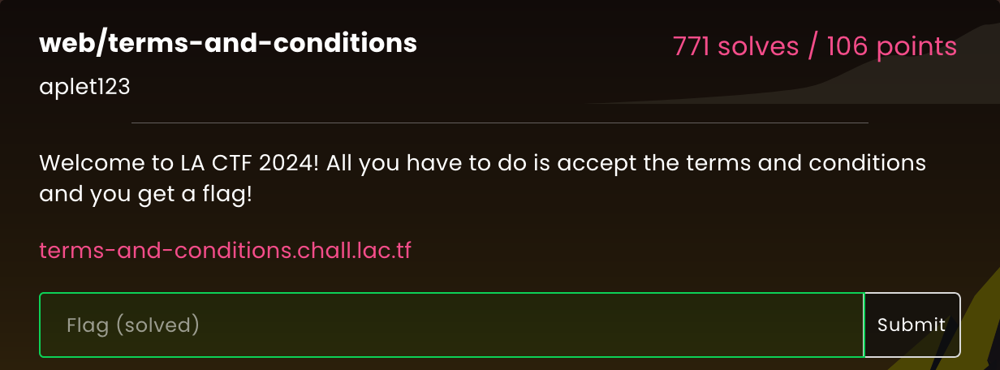
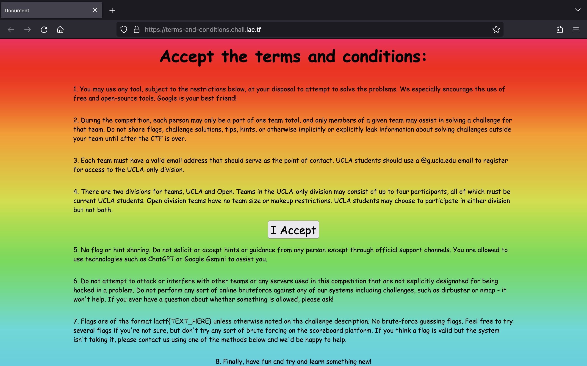
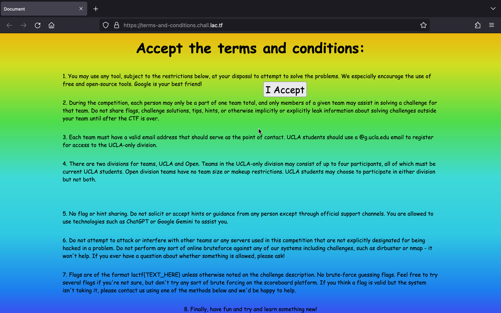
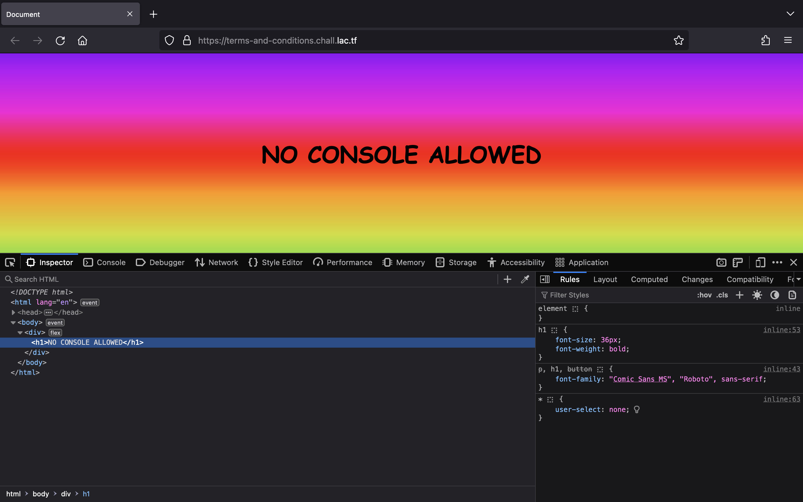
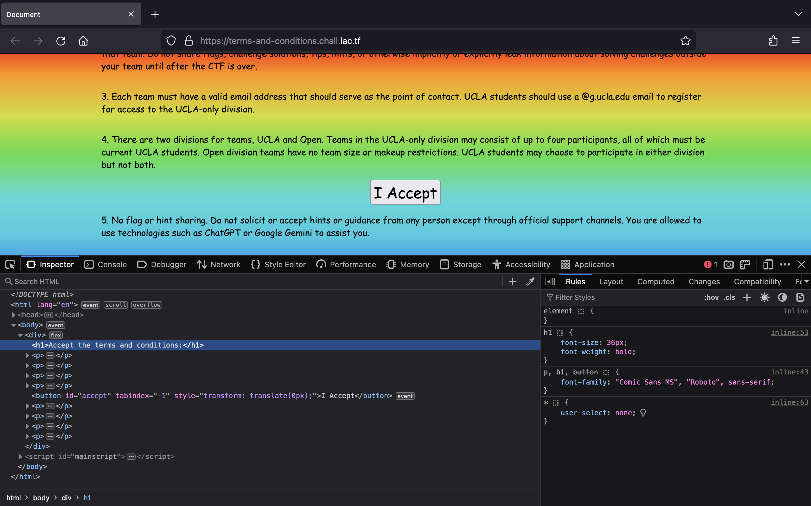
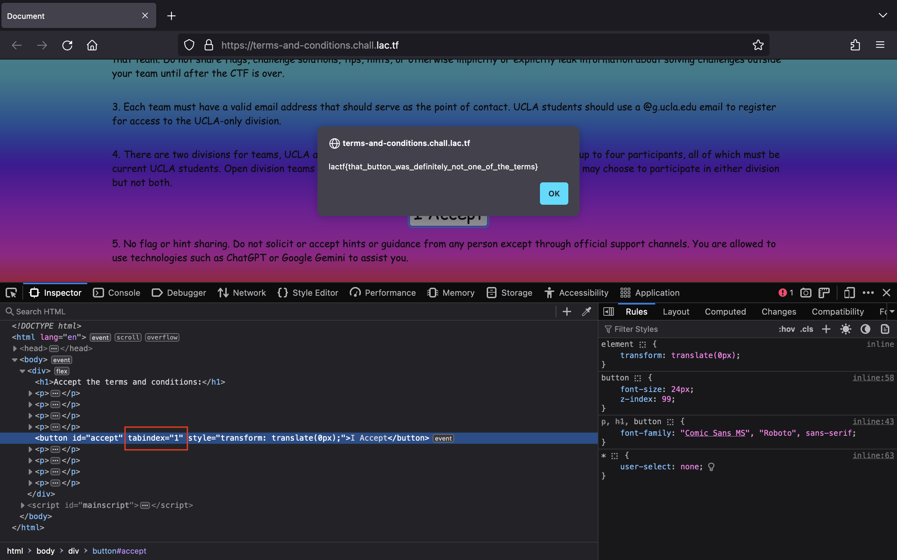

# terms-and-conditions

## Solution

Truy cập URL được cung cấp, chúng ta sẽ thấy trang web sau:

Để lấy được flag, chúng ta cần phải nhấn vào nút `I Accept`. Tuy nhiên, khi di chuyển con trỏ tới gần thì nó lại di chuyển đi:

Khi chúng ta Inspect thì trang web thay đổi nội dung:

Lúc này, chúng ta chỉ cần reload trang web là thấy được nội dung như ban đầu:

Chúng ta có thể sử dụng phím "Tab" điều hướng đến nút `I Accept` bằng cách đổi giá trị của attribute `tabindex` thành `1`. Sau đó, nhấn vào một vị trí bất kỳ trong trang và nhấn phím "Tab" rồi nhấn phím "Enter" chúng ta sẽ thấy được flag.

## Flag

`lactf{that_button_was_definitely_not_one_of_the_terms}`
