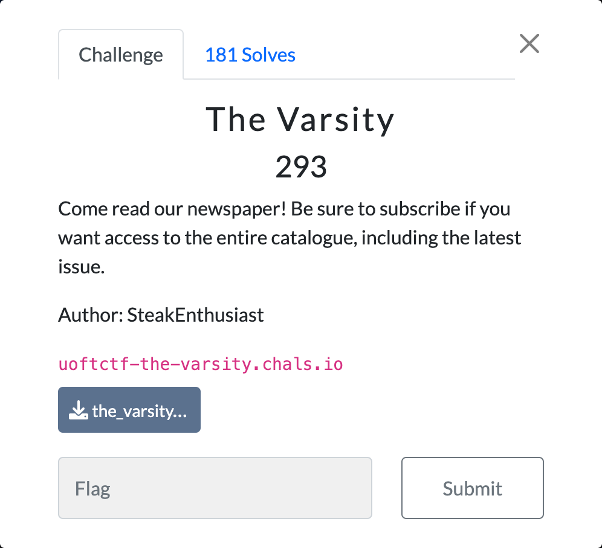
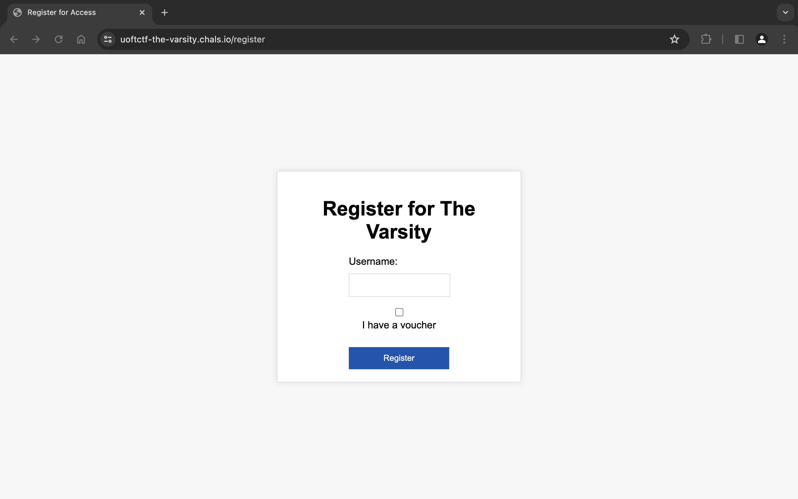
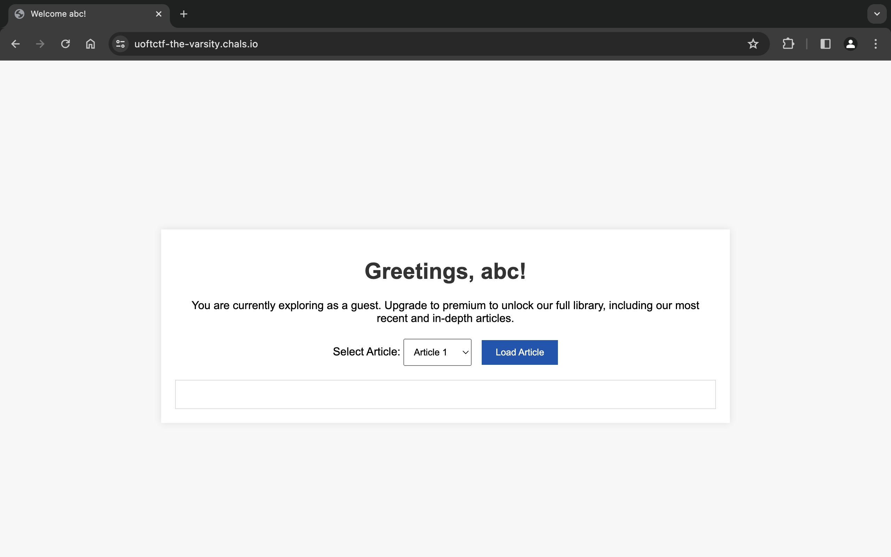
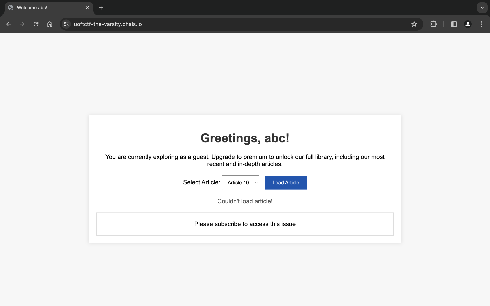
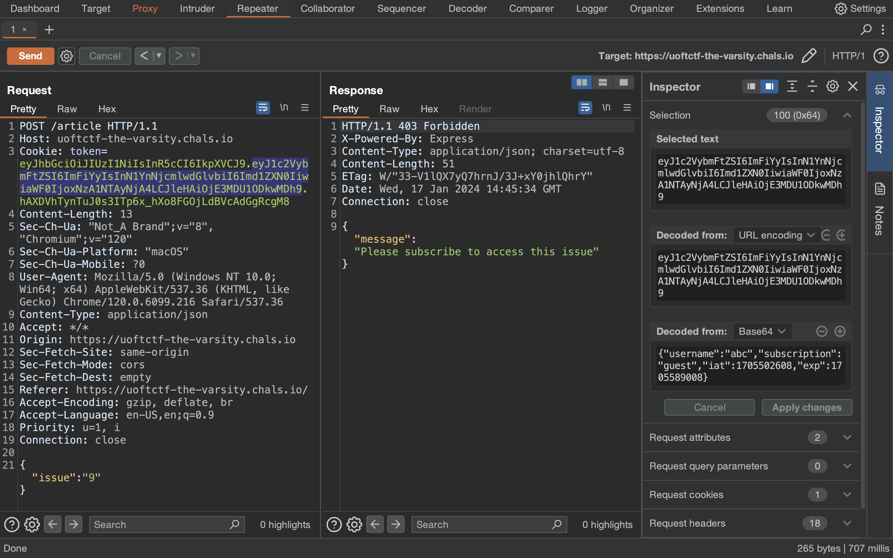
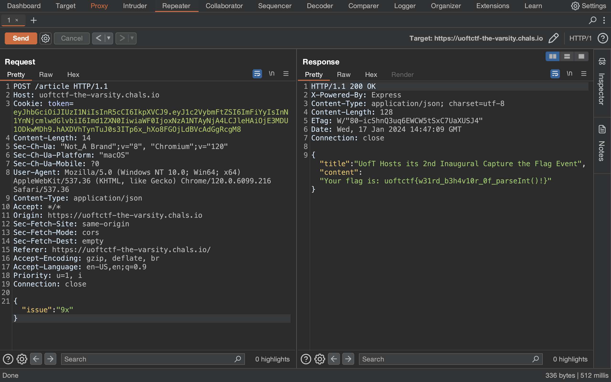

# The Varsity



## Solution

Trước tiên, mình truy cập vào trang web được cung cấp.



Sau khi register, mình thấy được trang cho phép mình đọc Article.



Mình có thể đọc được từ Article 1 tới Article 9 còn Article 10 thì nhận được thông báo lỗi.



Mình xem file `server.js` có đoạn code bên dưới sẽ xác thực mình có hợp lệ để đọc Article hay không.

```javascript
app.post("/article", (req, res) => {
  const token = req.cookies.token;

  if (token) {
    try {
      const decoded = jwt.verify(token, JWT_SECRET);

      let issue = req.body.issue;

      if (req.body.issue < 0) {
        return res.status(400).json({ message: "Invalid issue number" });
      }

      if (decoded.subscription !== "premium" && issue >= 9) {
        return res
          .status(403)
          .json({ message: "Please subscribe to access this issue" });
      }

      issue = parseInt(issue);

      if (Number.isNaN(issue) || issue > articles.length - 1) {
        return res.status(400).json({ message: "Invalid issue number" });
      }

      return res.json(articles[issue]);
    } catch (error) {
      res.clearCookie("token");
      return res.status(403).json({ message: "Not Authenticated" });
    }
  } else {
    return res.status(403).json({ message: "Not Authenticated" });
  }
});
```

Ban đầu mình thực hiện bypass JWT nhưng không thành công. Sau đó, từ hint của anh Đức mentor mình mới hiểu được mấu chốt ở đây là giá trị của `issue`.

Bây giờ, mình sẽ sử dụng **Burp Suite** để bắt request khi load Article 10.



Bởi vì giá trị của `decoded.subscription` là `"guest"` và của `issue` là `"9"` nên khối `if` đã được thực thi.

```javascript
if (decoded.subscription !== "premium" && issue >= 9) {
  return res
    .status(403)
    .json({ message: "Please subscribe to access this issue" });
}

issue = parseInt(issue);
// ...
return res.json(articles[issue]);
```

Tìm hiểu về hàm `parseInt()`, mình đổi `"9"` thành `"9x"` rồi gửi request thì đọc được Article 10 chứa flag.



## Flag

`uoftctf{w31rd_b3h4v10r_0f_parseInt()!}`