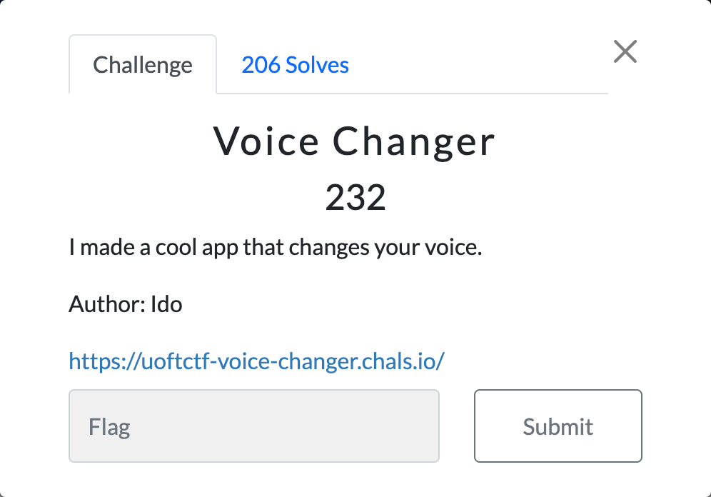
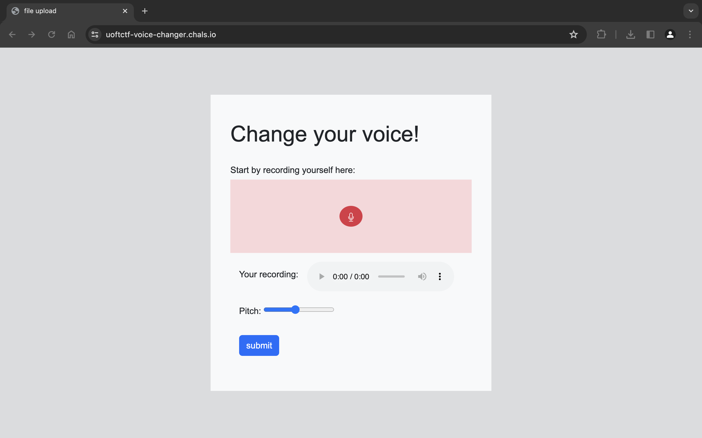
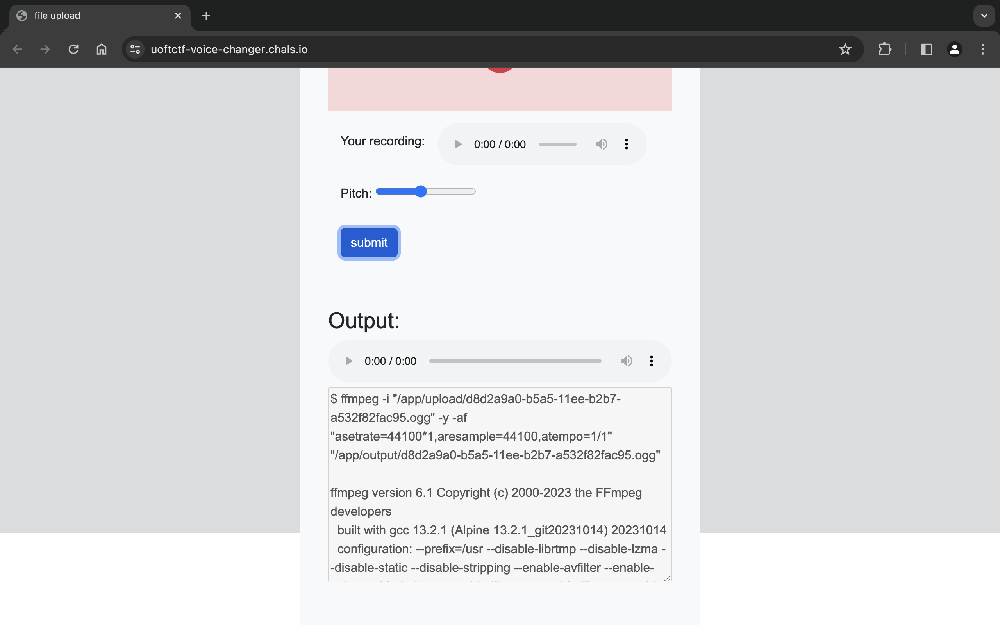
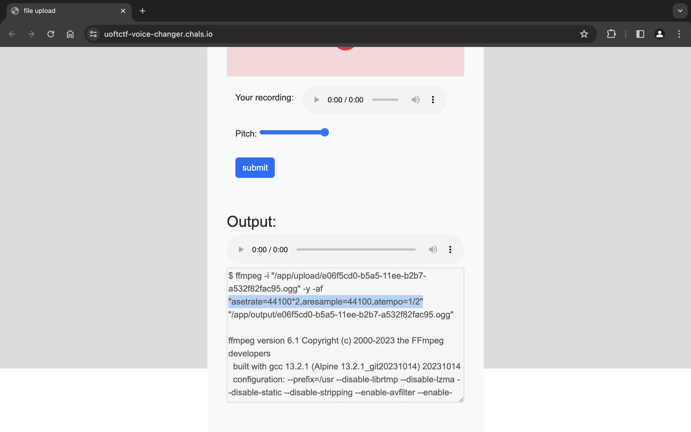
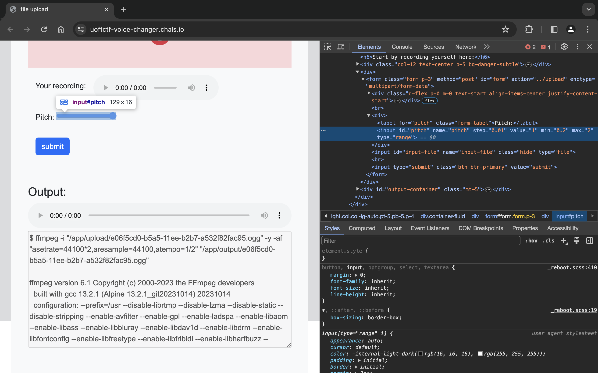
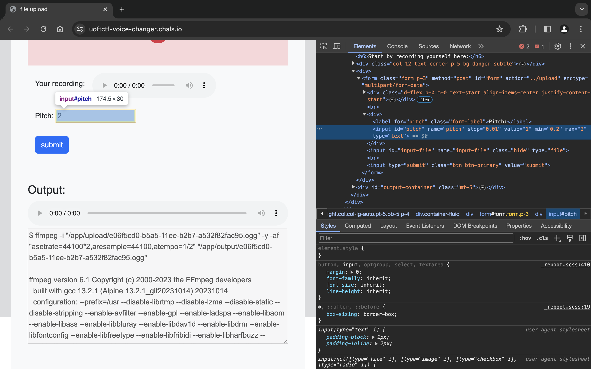
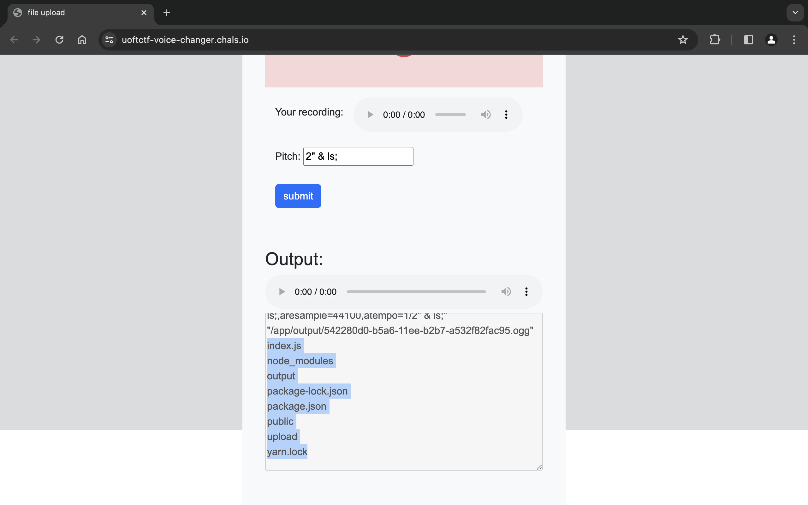
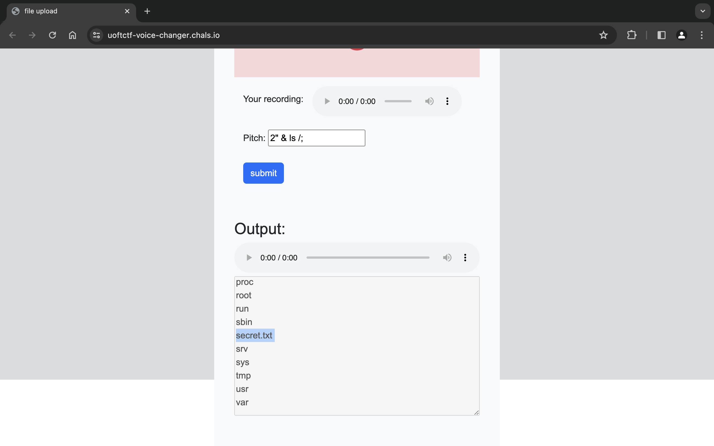
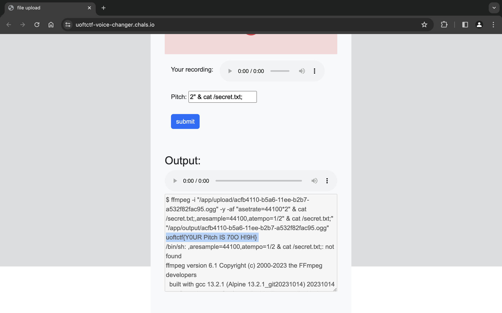

# Voice Changer

## Solution

Theo liên kết mình tới được trang web.

Khi nhấn submit mình nhận được phần Output trông giống với shell. Mình nghĩ sẽ thực hiện **Command Injection** để giải được challenge này.

Mình thử thay đổi giá trị của Pitch rồi submit thì thấy Output có sự khác biệt.

Mình inspect thấy giá trị `max` của Pitch cũng là `2` nên mình sẽ thử chèn payload thông qua thẻ input này.

Mình đổi `type="range"` thành `type="text"` để có thể nhập payload.

Thử với payload `2" & ls;` mình thấy có các folder và file của web.

Tiếp tục thử với payload `2" & ls /;` mình thấy có file `secret.txt`.

Mình đọc file đó bằng payload `2" & cat /secret.txt;` thì lấy được flag.

## Flag

`uoftctf{Y0UR Pitch IS 70O H!9H}`