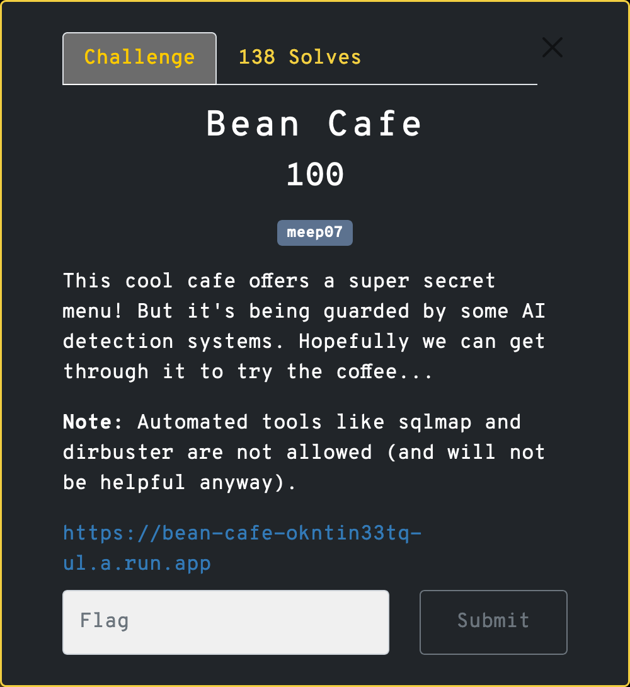
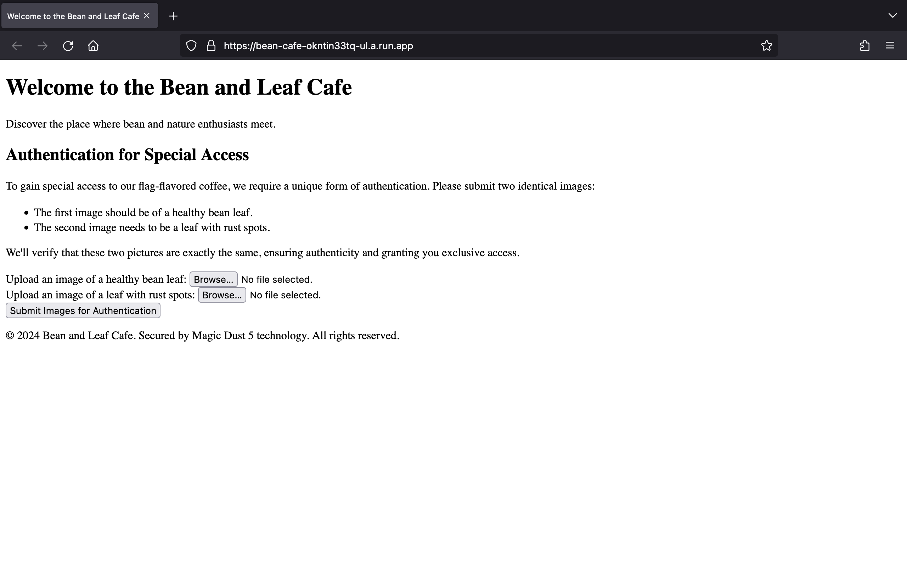
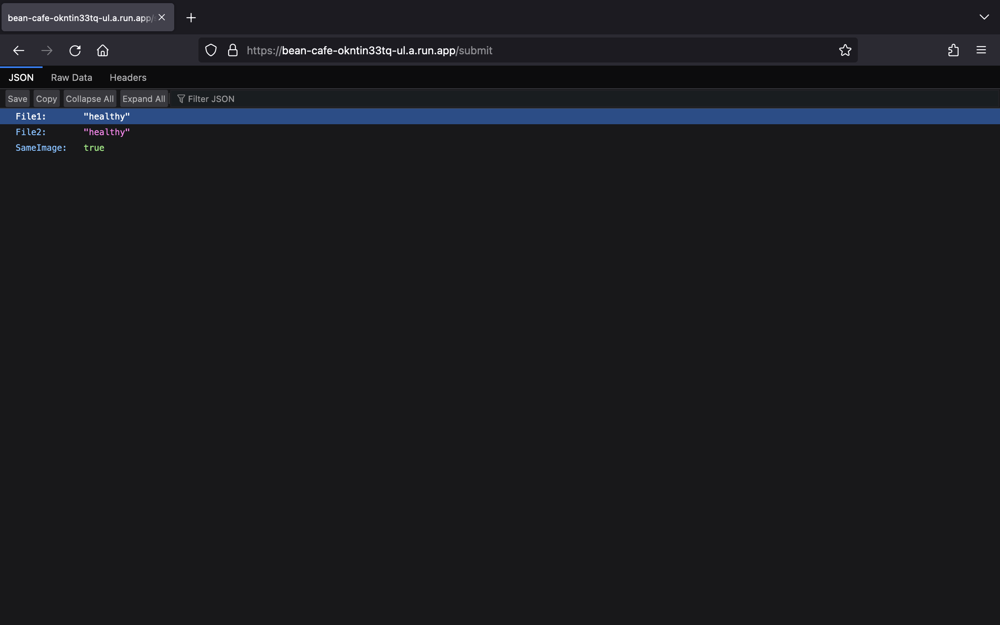
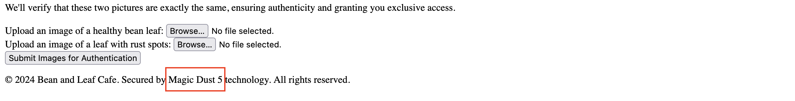
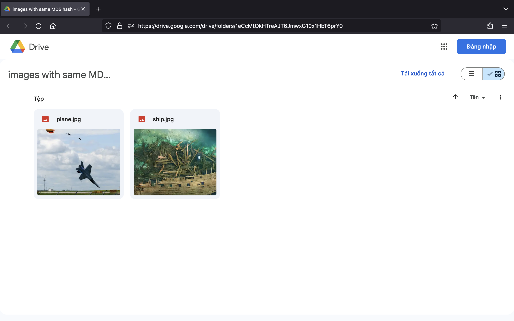
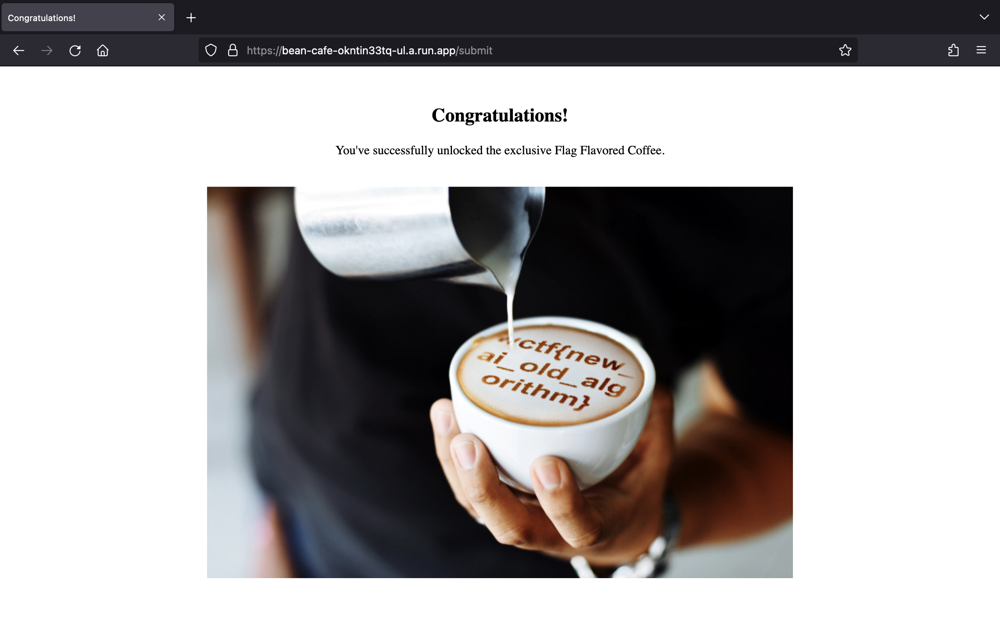

# Bean Cafe

## Solution

Truy cập vào URL được cung cấp, chúng ta có thể thấy một trang web như sau:

Trang web yêu cầu chúng ta phải tải lên 2 tấm ảnh giống hệt nhau để có thể lấy được flag.

Mình thử sử dụng cùng một tấm ảnh để tải lên nhưng lại nhận về kết quả như bên dưới:

Thú vị thật!

Quay trở lại đọc kĩ nội dung trong trang web, mình để ý thấy dòng cuối đang gợi ý tới MD5:

Tìm kiếm Google, mình thấy ngay [bài viết trên Reddit](https://www.reddit.com/r/DataHoarder/comments/gokrmx/these_different_2_images_has_the_same_md5_hash/) đề cập đến 2 bức ảnh khác nhau có cùng MD5 hash, kèm theo đó là liên kết tới Google Drive chứa 2 bức ảnh:

Mình tải về 2 ảnh [plane.jpg](images/plane.jpg) và [ship.jpg](images/ship.jpg).

Quay lại trang challenge, mình tải lên 2 ảnh đó đã thấy được flag:

## Flag

`wctf{new_ai_old_algorithm}`
